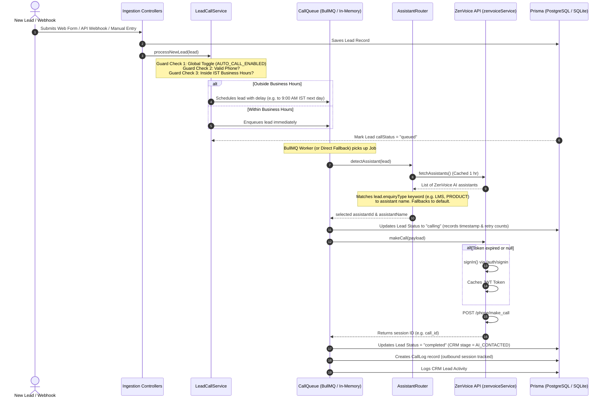

# ZenVoice AI Outbound Calling Integration
## Developer & Manager Knowledge Transfer (KT) Guide

This guide provides an end-to-end technical overview of how the CRM automatically initiates AI-driven outbound phone calls to new leads using the **ZenVoice Platform API** (powered by **ZenXAI**). 

---

## 📌 1. Architecture Map (Where is the Code?)

All function code and logic are separated into modular, clean-architecture layers:

| Component / Action | Responsible File Path | Key Functions | Purpose |
| :--- | :--- | :--- | :--- |
| **1. Authentication & API Requests** | [`zenvoiceService.js`](file:///c:/Users/PC%20User/Desktop/ZXCRM/ZX-CRM/backend/src/services/zenvoiceService.js) | `signIn()`, `requestWithAuth()` | Manages JWT token generation via `/auth/signin`, token caching, and auto-refresh on `401 Unauthorized` responses. |
| **2. Assistant Fetching** | [`zenvoiceService.js`](file:///c:/Users/PC%20User/Desktop/ZXCRM/ZX-CRM/backend/src/services/zenvoiceService.js) | `fetchAssistants()` | Retrieves all available AI agents from ZenVoice (`/assistants`) and caches them for **1 hour** to avoid rate limits. |
| **3. Intelligent Routing (Classification)** | [`assistantRouter.js`](file:///c:/Users/PC%20User/Desktop/ZXCRM/ZX-CRM/backend/src/services/assistantRouter.js) | `detectAssistant()` | Analyzes the lead's `enquiryType` (e.g. LMS, Services) and keyword-matches it against the ZenVoice assistant list to auto-select the best agent. |
| **4. Payload Normalization** | [`callPayload.js`](file:///c:/Users/PC%20User/Desktop/ZXCRM/ZX-CRM/backend/src/transformers/callPayload.js) | `normalizePhone()`, `buildCallPayload()` | Normalizes Indian & global numbers to standard E.164 format (`+91...`) and maps lead CRM details to ZenVoice metadata. |
| **5. Call Queue & Fallback Orchestration** | [`callQueue.js`](file:///c:/Users/PC%20User/Desktop/ZXCRM/ZX-CRM/backend/src/queues/callQueue.js) | `enqueueCall()`, `executeCallDirectly()`, `startWorker()` | Orchestrates calls one-by-one with exponential backoff retries using **BullMQ (Redis)**, or falls back to an **In-Memory Fire-and-Forget Process** if Redis is offline. |
| **6. Incoming Lead Pipeline Gateway** | [`leadCallService.js`](file:///c:/Users/PC%20User/Desktop/ZXCRM/ZX-CRM/backend/src/services/leadCallService.js) | `processNewLead()`, `getBusinessHoursDelay()` | Evaluates lead qualification guards (phone validity, duplicate checks) and schedules/delays calls to respect Indian Business Hours (e.g. 9 AM - 6 PM IST). |
| **7. Lead Capture Ingestions** | Multiple Controller Files | Controllers | Triggers the call pipeline from all lead ingestion channels: Webhooks, Lead Capture forms, CSV Uploads, and Manual Entries. |

---

## 🔄 2. Complete Lead-to-Call Sequence Workflow

Here is how a lead travels from ingestion to receiving an AI outbound call. 



---

## 🔍 3. Code Deep-Dive: Core Functions

### A. Authentication & Sign-in (Security Layer)
**Location:** [`zenvoiceService.js` (lines 19-45)](file:///c:/Users/PC%20User/Desktop/ZXCRM/ZX-CRM/backend/src/services/zenvoiceService.js#L19-L45)

To prevent overloading the ZenVoice API with a login request for every single call, the service **caches the JWT token in memory** and uses an **automatic token-refresh interceptor**.

```javascript
let cachedToken = null;

const signIn = async () => {
    const email = process.env.ZENVOICE_EMAIL;
    const password = process.env.ZENVOICE_PASSWORD;

    if (!email || !password) {
        throw new Error("[ZenVoice] ZENVOICE_EMAIL and ZENVOICE_PASSWORD must be set in .env");
    }

    try {
        const response = await axios.post(`${ZENVOICE_BASE_URL}/auth/signin`, {
            email,
            password,
        }, { timeout: 15000 });

        const token = response.data?.data?.token || response.data?.token;
        if (!token) {
            throw new Error("No token returned in ZenVoice signin response");
        }

        cachedToken = token;
        console.log("[ZenVoice] Successfully authenticated and acquired JWT token");
        return cachedToken;
    } catch (err) {
        console.error("[ZenVoice] Sign-in failed:", err?.response?.data || err.message);
        throw err;
    }
};
```

> [!TIP]
> **Resiliency Feature:** `requestWithAuth()` wraps all requests. If a request fails with a `401 Unauthorized` (indicating the cached token expired), it immediately performs a fresh `signIn()` behind the scenes and retries the original request. The CRM operator/lead never experiences a timeout.

---

### B. Assistant Fetching & Intelligent Routing (Context Matching)
**Locations:** 
- [`zenvoiceService.js` (lines 105-132)](file:///c:/Users/PC%20User/Desktop/ZXCRM/ZX-CRM/backend/src/services/zenvoiceService.js#L105-L132) - *Fetching and Caching*
- [`assistantRouter.js` (lines 28-65)](file:///c:/Users/PC%20User/Desktop/ZXCRM/ZX-CRM/backend/src/services/assistantRouter.js#L28-L65) - *Fuzzy Classification*

Instead of hardcoding a single AI assistant ID, the system queries the active assistants inside your ZenVoice platform and maps the lead to the most relevant voice agent:

```javascript
const ENQUIRY_KEYWORDS = {
    PRODUCT: ["product"],
    SERVICES: ["service"],
    WHITE_LABEL: ["white", "label", "whitelabel"],
    LMS: ["lms", "learning", "management"],
};

const detectAssistant = async (lead) => {
    const assistants = await fetchAssistants(); // Retrieves cached list (1 hour TTL)

    if (!assistants || assistants.length === 0) {
        throw new Error("[AssistantRouter] No assistants available in ZenVoice account");
    }

    const enquiryType = (lead.enquiryType || "").toUpperCase();
    const keywords = ENQUIRY_KEYWORDS[enquiryType] || [];

    // Try to find a matching assistant by name keyword
    if (keywords.length > 0) {
        for (const assistant of assistants) {
            const name = (assistant.name || assistant.title || "").toLowerCase();
            const matched = keywords.some(kw => name.includes(kw));
            if (matched) {
                return {
                    assistantId: assistant.id,
                    assistantName: assistant.name || assistant.title,
                    assistantType: enquiryType.toLowerCase(),
                };
            }
        }
    }

    // Fallback: Use the very first assistant in your account if no keyword matches
    const fallback = assistants[0];
    return {
        assistantId: fallback.id,
        assistantName: fallback.name || fallback.title,
        assistantType: "default",
    };
};
```

---

### C. Outbound Call Trigger & Metadata Mapping
**Locations:**
- [`zenvoiceService.js` (lines 139-156)](file:///c:/Users/PC%20User/Desktop/ZXCRM/ZX-CRM/backend/src/services/zenvoiceService.js#L139-L156) - *Making HTTP Request*
- [`callQueue.js` (lines 67-166)](file:///c:/Users/PC%20User/Desktop/ZXCRM/ZX-CRM/backend/src/queues/callQueue.js#L67-L166) - *Orchestrating DB Updates & Logging*

The call trigger performs the standard POST requests, normalization, updates CRM statuses, and pushes activity logs:

```javascript
const makeCall = async (payload) => {
    try {
        const data = await requestWithAuth("post", `${ZENVOICE_BASE_URL}/phone/make_call`, payload);
        console.log(`[ZenVoice] Call initiated: ${payload.phoneNumber} → assistant: ${payload.selectedAssistant}`);
        return data;
    } catch (err) {
        const status = err?.response?.status;
        const message = err?.response?.data?.message || err.message;
        console.error(`[ZenVoice] make_call failed (${status}): ${message}`);

        const error = new Error(`ZenVoice API error (${status}): ${message}`);
        error.statusCode = status;
        error.retryable = status >= 500 || status === 429 || !status; // Marks retry eligibility
        throw error;
    }
};
```

> [!NOTE]
> **ZenVoice Call Payload structure:**
> ```json
> {
>   "phoneNumber": "+91XXXXXXXXXX",
>   "fromPhoneNumber": "+17752427674",
>   "selectedAssistant": "assistant-uuid-here",
>   "metadata": {
>     "name": "Customer Name",
>     "email": "customer@email.com",
>     "crmLeadId": "lead-database-id",
>     "source": "META_ADS",
>     "enquiryType": "LMS"
>   }
> }
> ```

---

## 🛡️ 4. Enterprise-Grade Scale & Resiliency Features

### 1. Indian Business Hours Scheduler
To protect customer goodwill and comply with telecom regulations, calls are scheduled using `getBusinessHoursDelay()`. If a lead arrives outside business hours (e.g. 10:00 PM), it stays in `queued` status and triggers at 9:00 AM IST the next morning.

### 2. High-Availability Direct In-Memory Fallback
If the Redis cluster goes down:
1. `isRedisConnected()` in [`leadCallService.js`](file:///c:/Users/PC%20User/Desktop/ZXCRM/ZX-CRM/backend/src/services/leadCallService.js#L127-L142) detects the offline status.
2. It bypasses BullMQ queue ingestion.
3. It spawns a background thread using Node.js's `setImmediate()` to execute `executeCallDirectly()` immediately.
4. **Result:** The system continues calling leads with **0% downtime** and **0% impact** to your main lead creation HTTP requests.

### 3. BullMQ Retry Engine & Exponential Backoff
For network errors or API rate limits, BullMQ is configured to retry calling up to **5 times** using **exponential backoff** (`5s` ➔ `10s` ➔ `20s` ➔ `40s` ➔ `80s`). If all retries fail, it updates the lead to `failed` and triggers an activity log for administrative review.

---

## 🧪 5. How to Run Diagnostics & Test Scripts

You can run automated test scripts directly from the workspace root to check ZenVoice APIs without needing to wait for a mock lead:

### 1. Test Number Registration & Twilio Settings
Verifies your auth token, connection, and pulls your registered outbound phone numbers:
```powershell
node backend/testGetNumbers.js
```

### 2. Test Outbound Calling Directly
Bypasses the CRM pipeline and triggers a direct test call to a target number (pre-configured in the script to your personal testing number):
```powershell
node backend/testZenVoiceDirectly.js
```

---

## 🛠️ 6. Bug-Solving & Troubleshooting Scenarios

### 🚨 Scenario A: Outbound Call is skipping and showing "skipping auto-call" in logs.
* **Root Cause:** missing environment variables in `.env`.
* **Fix:** Ensure [`backend/.env`](file:///c:/Users/PC%20User/Desktop/ZXCRM/ZX-CRM/backend/.env) contains:
  ```env
  AUTO_CALL_ENABLED=true
  ZENVOICE_BASE_URL=https://voice.zenxai.io/api/v1
  ZENVOICE_EMAIL=your_email@hexitetechnologies.com
  ZENVOICE_PASSWORD=YourPassword
  ZENVOICE_FROM_PHONE=+17752427674
  ```

### 🚨 Scenario B: Token unauthorized (401) continuously appearing in terminal logs.
* **Root Cause:** Invalid ZenVoice login email or password.
* **Fix:** Execute [`backend/src/scratch/test-zenvoice.js`](file:///c:/Users/PC%20User/Desktop/ZXCRM/ZX-CRM/backend/src/scratch/test-zenvoice.js) to test Basic, Login, and Signin methods separately. If all fail, request new credentials from the ZenVoice admin dashboard.

---

## 🚀 7. Scalability Roadmap: Enhancements for the Future

To improve this integration and increase the value you deliver to the team:

1. **Lead Score-Based Priority Routing:** Integrate with `leadScorer.js` to dynamically give immediate high priority (Priority: 1) in BullMQ to Warm/Hot leads (Score > 75), and queue cold leads (Score < 50) for batch/delayed processing.
2. **Webhook Callback Processing:** Set up an endpoint in `webhook.js` that ZenVoice can ping when a call concludes (completed, busy, rejected). This will allow you to update the CRM lead record with the **AI Call Transcript, duration, customer sentiment analysis, and call recording audio link** in real-time.
3. **Multi-Agent Language Selection:** Extend `assistantRouter.js` to detect a lead's language preference (e.g. English, Hindi, Tamil) and route the call to a language-specific ZenVoice voice agent.
